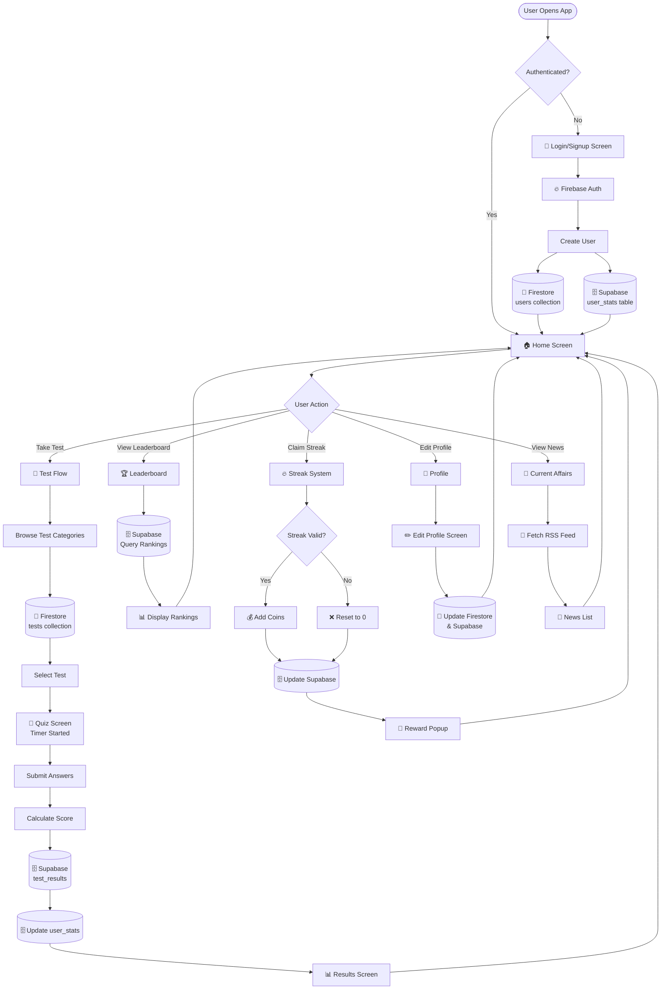
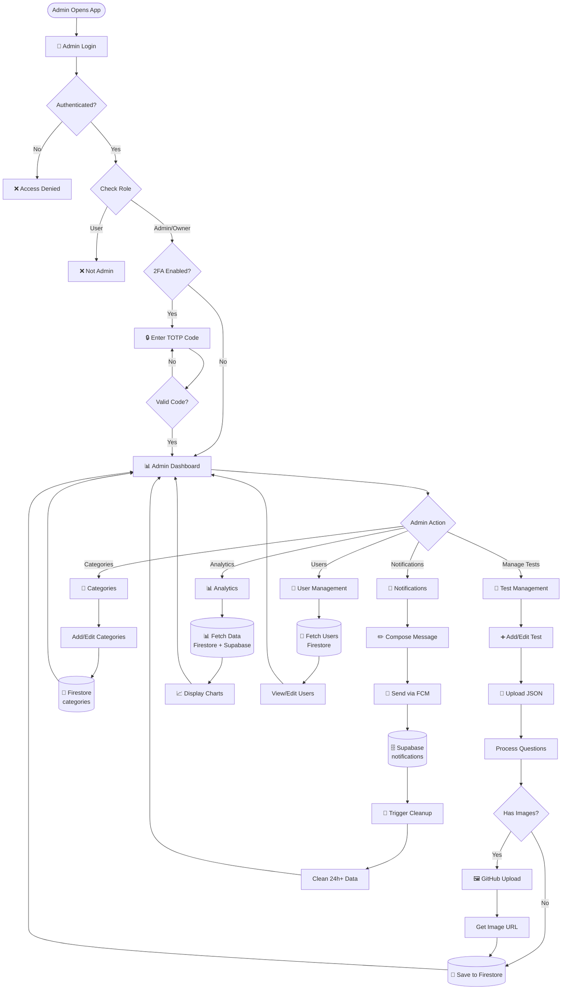
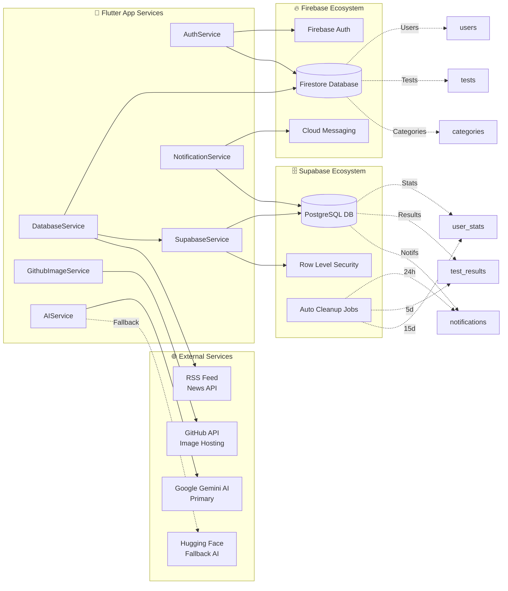
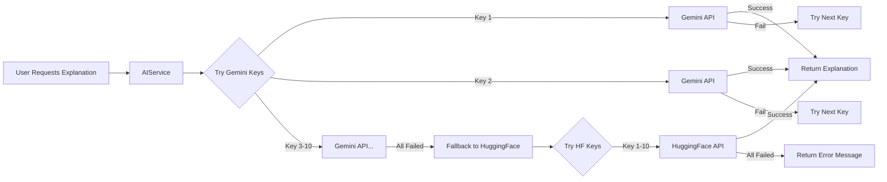
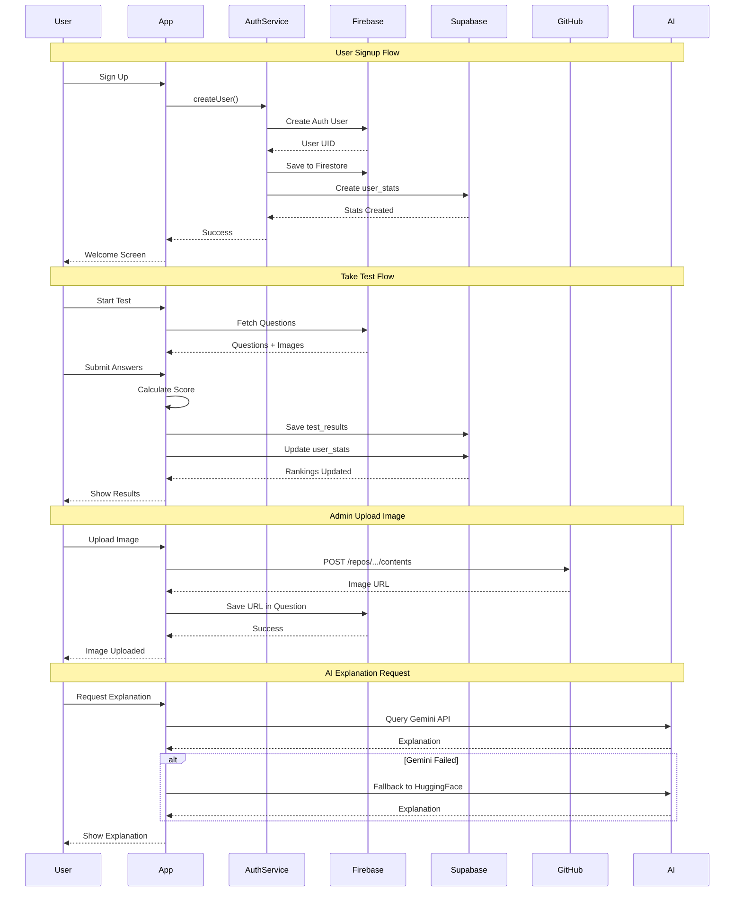
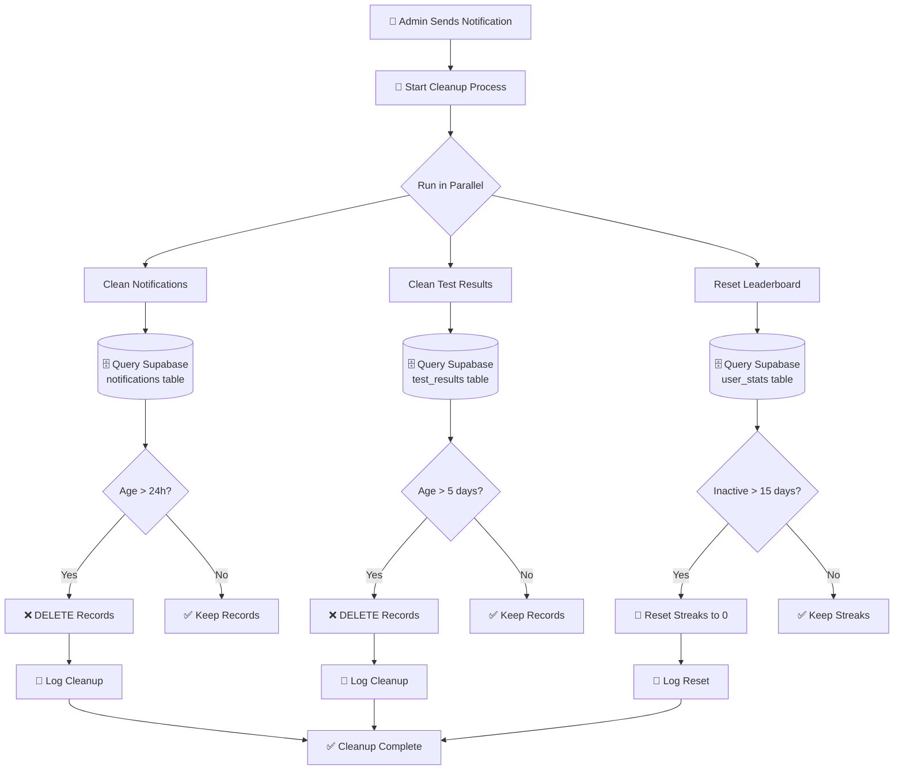
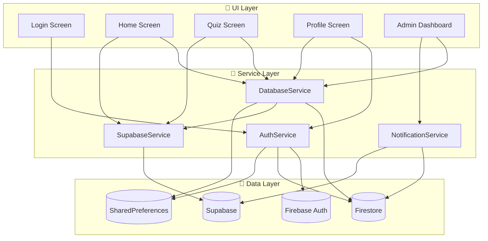

# 🔄 App Workflow - Visual Flow Diagrams

Complete visual workflow showing how the app works from user signup to admin management.

---

## 📱 Complete User Journey Flow



---

## 👨‍💼 Admin Flow with 2FA



---

## 🗄️ Database Architecture & Connections



---

## 🤖 AI Agents Configuration

### Google Gemini AI (Primary)



### AI Configuration Details

**File Locations:**
- **API Keys**: `lib/config/api_config.dart`
- **Service**: `lib/services/ai_service.dart`

**Gemini Configuration:**
```dart
// lib/config/api_config.dart
static const List<String> _geminiKeysEnc = [
  // 10 obfuscated Gemini API keys
];

// lib/services/ai_service.dart
Future<String?> _generateWithGemini(String prompt, String apiKey) {
  final model = GenerativeModel(
    model: 'models/gemini-1.5-flash',
    apiKey: apiKey,
  );
  // Generate explanation
}
```

**Hugging Face Configuration:**
```dart
// lib/config/api_config.dart
static const List<String> _hfKeysEnc = [
  // 10 obfuscated Hugging Face API keys
];

// lib/services/ai_service.dart
Future<String?> _generateWithHuggingFace(String prompt, String apiKey) {
  const modelId = 'google/flan-t5-base';
  const url = 'https://api-inference.huggingface.co/models/$modelId';
  // API call with Bearer token
}
```

**Key Features:**
- ✅ 10 API keys per provider for redundancy
- ✅ Automatic key rotation on failure
- ✅ Obfuscated keys using `SecurityService`
- ✅ Seamless fallback from Gemini to HuggingFace
- ✅ Error handling with user-friendly messages


---

## 🔄 Complete Data Sync Flow



---

## 🧹 Auto Cleanup System Flow



---

## 🎯 Feature Module Connections



---

This workflow document provides complete nvisual flows with better color contrast for readability! 🚀
